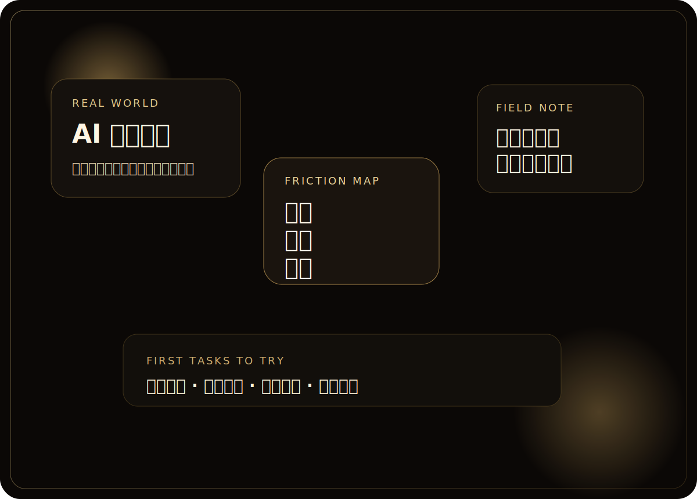
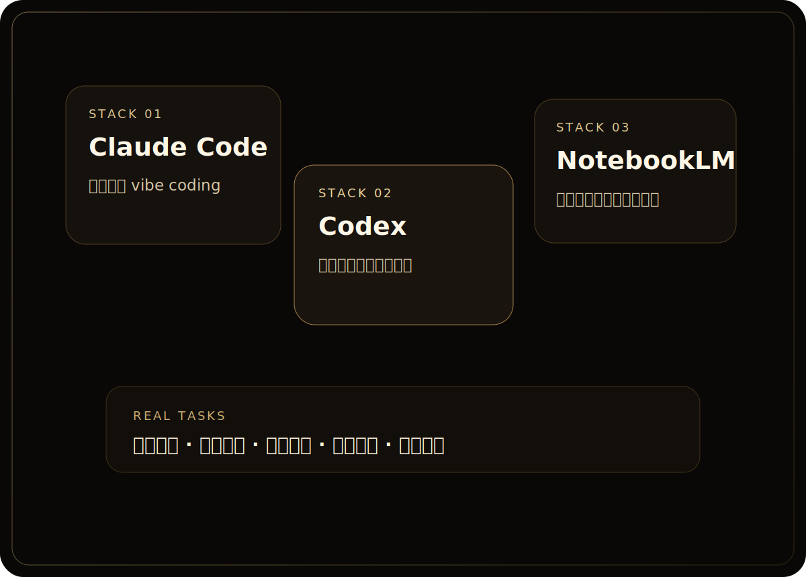
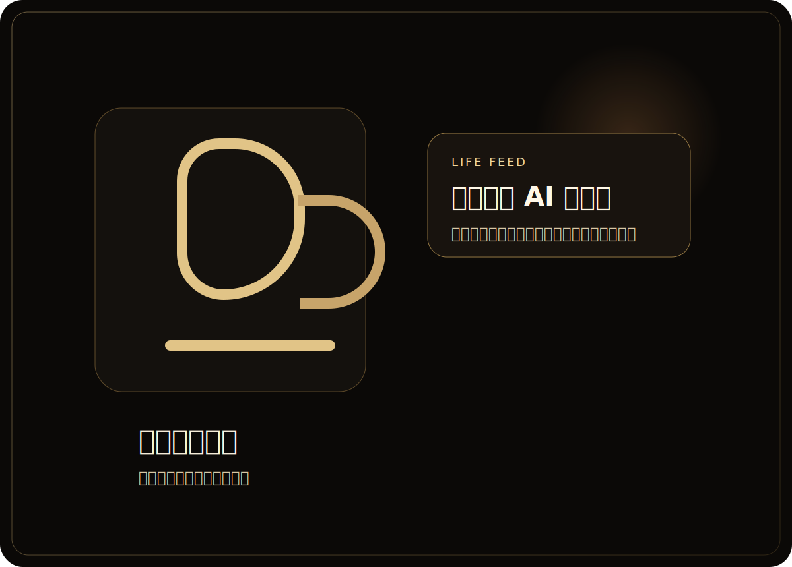

  

    
JASON LIN / AI IN MANUFACTURING

    <h1>我是 Jason，把企業 AI 落地經驗整理成真的能拿來用的方法。</h1>
    

      我是一名在傳統製造業導入 AI 的 00 後。這裡不會主打很高大上的架構圖，而是記錄我怎麼把 AI 放進真實工作流程，
      包括推專案時的阻力、常用工具與 Prompts、Obsidian 知識整理方式，以及下班後用手沖咖啡讓自己慢下來的日常。
    

    

      <a href="./work-notes/" class="internal">先看工作心得</a>
      <a href="./prompts/" class="internal">看 AI 工具與 Prompts</a>
    

    

      

        Role
        <strong>AI 落地實踐者</strong>
      

      

        Context
        <strong>Manufacturing / Knowledge Work</strong>
      

      

        Current Stack
        <strong>Claude Code / Codex / NotebookLM</strong>
      

    

  

  

    

      

        
        
        
      

      

        

          <small>Main Topic</small>
          <strong>企業 AI 落地</strong>
          
真正卡住企業導入 AI 的，常常不是模型，而是流程、習慣、驗證責任與組織協作。

        

        

          <small>Real Use Cases</small>
          <strong>會議摘要 / 信件改寫 / 文件整理 / 簡報生成</strong>
          
我現在最常用 AI 的地方，不是炫技，而是把重複工作變得更快、更清楚。

        

        

          <small>Side Feed</small>
          <strong>Obsidian / Coffee / Reading</strong>
        

        

          <small>Status</small>
          <strong>Shipping Weekly</strong>
        

      

      

      

      

    

  

  

    Prompts
    工作心得
    興趣 / 閱讀
    喜好文章
    Obsidian 筆記
    Prompts
    工作心得
    興趣 / 閱讀
    喜好文章
    Obsidian 筆記
  

  <a href="./work-notes/在傳統製造業導入-AI，最先卡住的不是模型.html" class="editorial-card editorial-card--feature internal">
    
    

      
Feature Essay

      <h2>企業 AI 真正卡住的地方，不是模型，而是流程與習慣。</h2>
      
從最常見的三種阻力切進去，看現場怎麼真的把 AI 推起來。

    

  </a>

  

    <a href="./prompts/我目前最常用的-AI-工具組合.html" class="editorial-card internal">
      
      

        
Tool Stack

        <h3>我現在真的在用的 AI 工具組合</h3>
      

    </a>

    <a href="./interests-reading/泡咖啡這件事，怎麼幫我整理思緒.html" class="editorial-card internal">
      
      

        
Life Feed

        <h3>除了工作與 AI，我也想把人的部分留下來</h3>
      

    </a>
  

  <section class="tech-panel tech-panel-feature">
    
START WITH THIS

    <h2>如果你只先讀一篇，就先看這篇。</h2>
    

      <a href="./work-notes/在傳統製造業導入-AI，最先卡住的不是模型.html" class="internal">在傳統製造業導入 AI，最先卡住的不是模型</a>
      是目前最能代表這個網站的一篇文章。它能最快讓你知道我看待企業 AI 的角度，不是從模型炫技出發，而是從流程、習慣與現場阻力開始。
    

  </section>

  <section class="tech-panel tech-panel-feature">
    
WHO THIS IS FOR

    <h2>如果你也在公司裡推 AI，這個網站會先對你有用。</h2>
    

      如果你正在面對「同仁怕增加工作量」、「痛點不一定能直接套 AI」、「大家沒時間學」這些現實問題，
      這裡會比一般工具介紹文更接近真實工作現場。
    

    

      <a href="./work-notes/" class="internal">工作心得</a>
      <a href="./prompts/" class="internal">Prompts</a>
      <a href="./obsidian-notes/" class="internal">Obsidian 筆記</a>
    

  </section>

  <section class="tech-panel">
    
START HERE

    <h2>如果你是第一次來，我建議先從這三篇開始。</h2>
    <ul class="signal-list">
      <li>先看阻力<strong><a href="./work-notes/在傳統製造業導入-AI，最先卡住的不是模型.html" class="internal">在傳統製造業導入 AI，最先卡住的不是模型</a></strong></li>
      <li>讀完你會知道<strong>為什麼企業 AI 最常卡住的不是技術，而是流程與責任。</strong></li>
      <li>再看方法<strong><a href="./prompts/如何建立自己的常用指令庫.html" class="internal">如何建立自己的常用指令庫</a></strong></li>
      <li>讀完你會知道<strong>怎麼把 AI 變成真的會反覆用到的個人工具，而不是收藏清單。</strong></li>
      <li>最後看系統<strong><a href="./obsidian-notes/我怎麼用-Obsidian-管理工作中的-AI-知識.html" class="internal">我怎麼用 Obsidian 管理工作中的 AI 知識</a></strong></li>
      <li>讀完你會知道<strong>我怎麼把工具、Prompt 與工作經驗整理成可以長期累積的方法。</strong></li>
    </ul>
  </section>

  <section class="tech-panel">
    
WHY LISTEN

    <h2>我不是只在整理資訊，而是真的把 AI 放進自己的工作裡。</h2>
    

      從會議摘要、錄音整理待辦、信件改寫，到專案文件與簡報內容整理，再到用 Claude Code 快速推進 vibe coding 專案。
      這些是我真正有在用、也會持續整理成文章的方法。
    

  </section>

  <section class="tech-panel">
    
AROUND THE SITE

    <h2>除了 AI 與工作，這裡也會保留一些人的部分。</h2>
    

      <a href="./work-notes/" class="internal">工作心得</a>
      <a href="./prompts/" class="internal">Prompts</a>
      <a href="./obsidian-notes/" class="internal">Obsidian 筆記</a>
      <a href="./interests-reading/" class="internal">興趣 / 閱讀</a>
    

  </section>

  <section class="tech-panel">
    
REPRESENTATIVE POSTS

    <h2>這三篇最能代表我現在想寫的方向。</h2>
    <ul class="signal-list">
      <li>企業現場<strong><a href="./work-notes/企業內部推-AI-時，最常見的-5-種阻力.html" class="internal">企業內部推 AI 時，最常見的 5 種阻力</a></strong></li>
      <li>工作流<strong><a href="./prompts/我目前最常用的-AI-工具組合.html" class="internal">我目前最常用的 AI 工具組合</a></strong></li>
      <li>知識系統<strong><a href="./obsidian-notes/我怎麼用-Obsidian-管理工作中的-AI-知識.html" class="internal">我怎麼用 Obsidian 管理工作中的 AI 知識</a></strong></li>
    </ul>
  </section>

