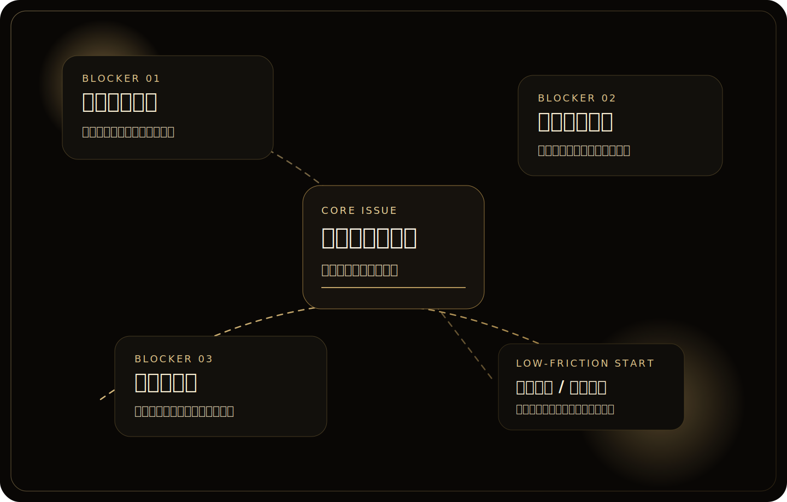

  

    
Feature Story / AI Adoption in Manufacturing

    <h2>真正卡住企業 AI 的，常常不是模型，而是「大家願不願意改變工作方式」。</h2>
    

      如果要用一句話總結這篇文章，我會說：企業裡最早出現的阻力，通常不是技術不夠，而是流程慣性、驗證責任與學習成本。
    

  

  

    

      最常聽到
      <strong>最後還不是我要重看一次</strong>
    

    

      最常見問題
      <strong>痛點不能直接套 AI</strong>
    

    

      現場現實
      <strong>根本沒有時間學</strong>
    

  

<figure class="article-visual-frame">
  
  <figcaption>把外部研究拉回現場後，我感受到的阻力通常會長成這三種樣子。</figcaption>
</figure>

如果只看外面的討論，會以為企業導入 AI 最難的是模型能力、資料量或技術選型。

但我自己在傳統製造業的現場感受剛好相反。真正最先卡住的，通常不是模型，而是流程、習慣、角色分工，還有大家對 AI 的想像落差。

  

    <small>01</small>
    <h3>增加工作量感</h3>
    
如果同仁感覺用了 AI 之後只是多一道驗證程序，就不會真的想改。

  

  

    <small>02</small>
    <h3>流程慣性</h3>
    
很多工作不是不能優化，而是原本那套做法已經熟到讓人不想動。

  

  

    <small>03</small>
    <h3>時間成本</h3>
    
工作節奏已經很滿時，「再學一套新工具」本身就會被當成阻力。

  

## 1. 大家以為 AI 是一個答案，不是一個流程

很多人第一次接觸 AI，會希望它直接給出一個完整答案。

但在企業場景裡，大部分工作不是一次問答就結束，而是要經過：

- 需求釐清
- 資料整理
- 回覆調整
- 與既有流程整合

如果沒有把這些步驟先想清楚，AI 很容易被期待成萬能工具，最後又因為效果不如預期而被放棄。

## 2. 真正的阻力通常來自工作習慣

很多工作流程不是不能優化，而是大家早就有習慣做法。

當你要導入 AI 時，實際上是在碰這些東西：

- 誰要先改變做事方式
- 誰要負責驗證 AI 產出
- 哪些內容可以交給 AI，哪些不行
- 新流程要不要被寫進 SOP

這些都不是模型可以自己解決的問題。

## 3. 現場最需要的不是炫技，而是低阻力的切入點

如果一開始就把導入方案做得太大，通常很容易卡住。

我自己比較偏向先找那種：

- 重複性高
- 可驗證
- 對現場有明顯省時效果

的任務先做。

例如把一段固定格式的整理工作交給 AI，讓大家先感受到「真的有省時間」，比直接談整套 AI 轉型更容易推動。

以我自己現在比較常先試的任務來說，像是：

- 整理會議摘要
- 把當下筆記或錄音整理成待辦事項
- 改寫信件
- 整理專案文件
- 幫簡報先整理出一版內容

這些事情的共同點就是重複、耗時，而且成果相對容易檢查。這種任務拿來當 AI 的第一批切入點，通常會比直接碰核心決策流程更容易推。

  

    低阻力任務
    <strong>會議摘要</strong>
  

  

    低阻力任務
    <strong>錄音整理待辦</strong>
  

  

    低阻力任務
    <strong>信件改寫</strong>
  

  

    低阻力任務
    <strong>專案文件整理</strong>
  

  

    低阻力任務
    <strong>簡報內容整理</strong>
  

## 4. 心態上的拉扯也很真實

導入 AI 不是只有技術問題，對推動的人來說，也很常有心理上的拉扯。

你會同時遇到：

- 想推快一點，但又怕太快被反感
- 想做出成果，但現場不一定立刻買單
- 知道方向是對的，但不知道怎麼讓更多人一起走

這些心路歷程如果不講，很多人會以為導入 AI 只是工具選型而已。

## 我想在這個網站記錄什麼

所以我之後想寫的，不會只是「哪個工具比較厲害」，而是：

- 在企業裡導入 AI 真正會遇到什麼
- 哪些做法比較容易成功
- 哪些問題其實每個現場都會遇到

如果這些內容能幫到同樣在企業裡推動 AI 的人，那這個網站就有它存在的價值。

  
Quick Takeaway

  

    如果你也正在公司裡推 AI，我會建議先不要急著追求最完整的方案。先找一個重複、可驗證、真的能幫現場省時間的小任務，
    讓大家先感受到「不是多做一套，而是真的少花一些時間」。
  

## 下一篇建議閱讀

如果你是第一次來這個網站，我會建議接著看：

- [[企業內部推 AI 時，最常見的 5 種阻力|企業內部推 AI 時，最常見的 5 種阻力]]

這篇會把阻力拆得更細。
